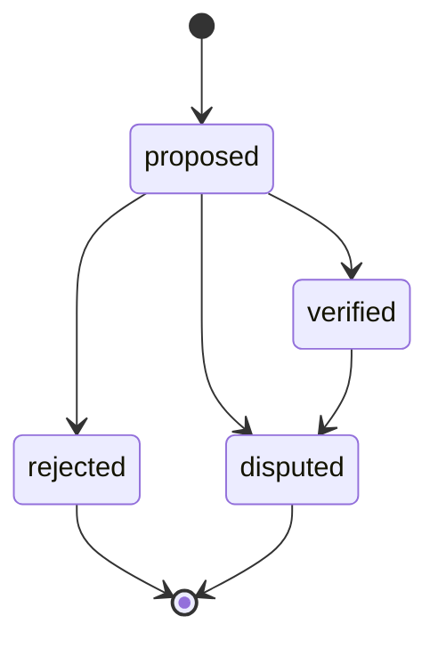

# Part 9.5.5-C3 — Artifact Registry + Provenance

## Implementation Contract Addendum V1.0

| Metadata | Value |
| --- | --- |
| Status | DESIGN FROZEN |
| Part | 9.5.5-C3 |
| Scope | Artifact Registry + Provenance |
| Implementation | NOT STARTED |
| Baseline | `a8d3104b3646edfb0ff92fcb11acdfc5a9c66af7` |
| PostgreSQL baseline | 16.x；当前验证版本 16.15 |
| Parent design | [Part 9.5.5-C Final Implementation Design Freeze](Part9.5.5-C_Family-Collaboration-Participant-Consent_Design-Freeze_V1.0.md) |

> DESIGN FROZEN != FEATURE IMPLEMENTED。
>
> 本文只冻结 C3 实施合同中剩余的技术细节，不修改父级 Design Freeze 的历史快照，不表示 C3 runtime、Migration、API 或测试已经实现。

## 1. Purpose and scope

本文补充冻结 Part 9.5.5-C3 的实现边界：

- `SourceArtifact`
- `SourceSpeakerBinding`
- `ArtifactContribution`
- `DerivedSource`
- 现有 Audio / Transcript / Segment / Message 接入 Artifact Registry
- 历史 Artifact 确定性回填
- Provenance DAG 的数据库并发安全
- Speaker 来源确认的身份绑定

本 Addendum 解决 C3 Preparation Report 识别出的三个 Blocking Medium：

1. `ArtifactContribution` 的不可变身份和受控状态转换；
2. 并发条件下 Provenance DAG 的无环保证；
3. 多态 Artifact 与现有内容实体的一一对应保证。

## External / Non-Family Participant Scope — V1

### Product decision and domain boundary

V1 采用 Option A：由 Interview 所属 Family 的 Owner 或 active Collaborator，针对**一个明确的 Interview**发起非家庭成员参与提议和邀请；当前邀请通知仅限线下或未来交付机制。

V1 支持能够自主作出授权决定的成年非家庭参与者，包括朋友、前同事、同学、邻居、战友、老师，以及其他与发起人本人认识的成年参与者。

此场景复用现有身份与参与模型：

- `User`：已认证的自然人；
- `FamilyMembership`：Family 档案协作关系；
- `InterviewParticipant`：一个特定 Interview 内的参与关系；
- `SourceSpeakerBinding`：参与者对一个 root Source 的实际贡献关系；
- Consent：由 C4 处理的用途授权。

非家庭参与者无需拥有 `FamilyMembership`。不得新增第二套身份体系，不创建 `Friend`、`FriendMember`、`FriendMembership`、`GuestIdentity` 或 `ExternalSpeakerIdentity`。

### Participation and confirmation flow

```text
Owner / active Collaborator
  -> 在一个特定 Interview 内创建 participant proposal
  -> 通过线下方式或未来的邀请交付机制通知参与者
  -> 参与者以自己的 User 身份完成认证
  -> 参与者本人完成 participant_confirmation
  -> 成为该 Interview 的 verified participant
  -> Owner / active Collaborator 可创建 C3 binding proposal
  -> 参与者本人确认自己的 SourceSpeakerBinding
  -> ArtifactContribution 受控投影建立
  -> C4 后续处理 Consent
```

C2B 已封板。本 Addendum 不修改 C2B 状态机、`participant_confirmation`、C2B API、测试或 Migration，只复用其已冻结的参与者提议和本人确认流程。

### Authorization and identity proof

- Owner 或 active Collaborator 可以为特定 Interview 创建 participant proposal，也可以为该 Interview 的 root Source 创建 binding proposal。
- 实际受邀者必须以自己的 `User` 身份亲自完成 `participant_confirmation`。
- 非家庭参与者只能确认与本人 verified `InterviewParticipant` 绑定的 `SourceSpeakerBinding`。
- Owner 或 Collaborator 不能代替非家庭参与者确认 binding；只有当操作者本人就是该 binding 对应的 Participant User 时，才能执行本人确认。
- Owner 或 Collaborator 不能认领非家庭参与者的 `User`、替其完成身份核验或代表其授予 Consent。
- 完成参与确认不会创建 `FamilyMembership`，也不会赋予 Family Archive 浏览权、其他 Interview 访问权、其他 Speaker 内容访问权或 Collaborator 权限。
- 关系描述只用于表达人物关系，不是权限角色；不得加入 `FamilyMembership.role`、`InterviewParticipant.roles` 或 `SourceSpeakerBinding.state`。未来 UI 如需关系标签，必须另行作出产品与数据模型决策。

`User` 归属只能来自 `participant_confirmation`。系统不得根据 `FamilyMember`、姓名、关系描述、邮箱文本、STT speaker label、Owner 声明、Collaborator 声明或 Operator 声明自动推定或认领参与者身份。

### Provenance and scope constraints

非家庭参与者适用与家庭参与者相同的 C3 provenance 规则：

- `SourceArtifact.interview_scope_id` 必须等于已确认的 `InterviewParticipant.interview_scope_id`；
- cross-interview binding 必须拒绝；
- `FamilyMembership` 不得成为创建、确认或验证非家庭参与者 binding 的约束条件；
- `ArtifactContribution` 仍由合法 binding 产生，并遵守既有 locator、不可变字段与状态转换合同。

### Delivery and C3 / C4 boundary

C3 不实现短信、邮件、微信、地址簿、好友搜索、好友发现或其他生产邀请交付能力。V1 合同只冻结由 Owner / active Collaborator 发起、参与者本人认证和确认的领域边界；线下通知可以支持当前流程，但不得表述为生产邀请交付已经实现。

C3 只处理来源身份、Speaker binding、贡献投影与 provenance。`ConsentGrant`、`ConsentEvent`、`SourceConsentBinding`、`SourceRestoreRequest` 和 Access Gate 仍属于 C4。即使非家庭参与者已经完成 participant confirmation 和 binding confirmation，新 Artifact 在 C4 有效授权与访问门禁实施前仍保持 `quarantined`，不得进入普通可用或共享状态。

## Mentioned Third-Party Person Boundary — V1

### Participating person and mentioned person

V1 必须区分以下两种情况：

- **实际参与者**：非家庭成员本人实际加入 Interview 并发言。此时复用已经冻结的 `User` + `InterviewParticipant` + `SourceSpeakerBinding` + `ArtifactContribution` 流程，并遵守 **External / Non-Family Participant Scope — V1**。
- **仅被提及者**：某个人只出现在 Interview、回忆录或其他 Source 的叙述内容中，没有实际参加该 Interview。C3 只把该姓名或描述视为 Source 正文中的信息。

例如讲述者说“我的朋友李某和我曾一起服役”，而李某没有参加该 Interview，系统不得因为这句话自动创建或认定：

- `User`；
- `InterviewParticipant`；
- `FamilyMembership`；
- `FamilyMember`；
- `SourceSpeakerBinding`；
- `ArtifactContribution`；
- Consent identity；
- Friend entity。

### C3 provenance responsibility

C3 只保存与该提及有关的 provenance：

- 哪个 Audio、Message、Transcript 或 Segment 包含该提及；
- 哪个 `SourceArtifact` 表示对应内容；
- 哪些 derived artifacts 来源于该内容。

C3 不执行语义人物抽取、身份解析、社会关系建模或人物去重。

### Part 9.6 Memory boundary

从回忆内容中抽取人物属于 Part 9.6 Memory Extraction。9.6 可以在单独设计评审后引入中性的人物提及候选概念，例如 `MemoryPersonCandidate` 或等价模型；C3 不冻结最终表名或模型名。

未来可能识别的 friend、classmate、colleague、neighbor、teacher、comrade、relative、other 等标签只描述回忆中的人物关系，不是授权角色。

### Identity and future-linking safety

系统不得根据以下信息把仅被提及者推定为真实 `User`：

- 姓名匹配；
- 邮箱文本；
- 电话文本；
- `FamilyMember` 姓名；
- STT speaker label；
- Owner 声明；
- Collaborator 声明；
- AI extraction；
- relationship label。

冻结以下语义边界：

- mentioned person != authenticated `User`；
- mentioned person != `InterviewParticipant`；
- mentioned person != Speaker；
- mentioned person != Consenter；
- mentioned person 不产生 Consent。

如果旧内容中被提及的人以后实际参加 Interview，后续 verified `User` / `InterviewParticipant` 不得通过姓名匹配自动关联到旧人物提及。未来任何关联都必须经过独立评审的显式 identity-linking workflow；C3 只保留支持该流程所需的 provenance。该参与者仍必须完成正常的 Participant 本人确认。

### Privacy boundary

被回忆内容提及不会赋予该人物 Family Archive 访问权、`FamilyMembership`、Participant 状态或 Speaker 状态。Owner 提及某位朋友，也不会代表对方创建 Consent。

C3 不决定回忆录正文涉及第三人的隐私发布政策，该政策留给后续产品与隐私设计。

### Example

当 Interview subject 说“我的朋友赵建国和我一起服役了三年”时：

- C3 记录包含该陈述的 Audio / Message 及相关 Artifact provenance；
- C3 不认定赵建国是 `User`、Participant、STT speaker 或已经提供 Consent；
- Part 9.6 后续可以为回忆整理抽取一个人物候选，但须经单独设计；
- 如果赵建国以后亲自参加 Interview，仍必须按正常流程完成 Participant 本人确认，不按姓名自动关联。

### No new C3 person entity

C3 本阶段不新增 `MemoryPerson`、`MemoryPersonCandidate`、`PersonMention` 或 `SocialRelationship` 数据库表。这些概念需要 Part 9.6 单独设计评审。

## 2. Decision A — ArtifactContribution

### 2.1 Persistence role

`ArtifactContribution` 是**持久化的受控投影**，不是 append-only event table。

父级 Design Freeze 的“追加且不可改写”在实施中解释为：provenance 身份事实追加建立且不可改写；verification 状态是受控的当前投影。本 Addendum 明确这一区分，不修改父级历史快照，不引入 `ContributionEvent` 表。

字段：

| Field | Requirement |
| --- | --- |
| `id` | UUID primary key |
| `artifact_id` | FK → `SourceArtifact.id`，RESTRICT |
| `source_speaker_binding_id` | FK → `SourceSpeakerBinding.id`，RESTRICT |
| `locator` | 白名单 JSON 定位元数据，可空 |
| `verification_state` | 受控状态，客户端不可写 |
| `version` | 正 BIGINT；每次合法转换递增 |
| `created_at` | timezone-aware UTC |
| `updated_at` | timezone-aware UTC |

创建后不可修改：

- `id`
- `artifact_id`
- `source_speaker_binding_id`
- `locator`
- `created_at`

`UNIQUE(artifact_id, source_speaker_binding_id)` 保持有效。

仅 `verification_state`、`version`、`updated_at` 可随合法投影转换更新。

### 2.2 Verification states

允许的 `verification_state`：

- `proposed`
- `verified`
- `rejected`
- `disputed`

允许的 C3 状态转换：



- `rejected`：C3 终态。
- `disputed`：C3 受限终态。
- 不允许从 `rejected` 或 `disputed` 恢复。
- 不允许通用 CRUD UPDATE、客户端 PATCH 或任意状态赋值。
- 只有 Service/domain workflow 可以执行合法转换。
- 每次转换必须满足 `expected_version == current_version`，并将 `version` 精确加一：`new_version == old_version + 1`。

PostgreSQL 必须通过 trigger 阻止：

- 非法状态转换；
- identity / locator 改写；
- version 跳跃、回退或未递增；
- 不符合状态及字段约束的直接 SQL UPDATE。

Service 负责授权和业务转换入口；PostgreSQL trigger 负责结构安全约束。数据库不能识别调用者是否来自 Python Service，也不能仅凭调用来源拒绝符合结构约束的 SQL。不得宣称 trigger 能证明 Service 授权已执行。

### 2.3 Binding relationship

`SourceSpeakerBinding` 是 Speaker 确认身份事实的权威来源。

`ArtifactContribution.verification_state` 是该贡献关系的受控投影，不替代 Binding 的本人确认事实。

Binding 的确认、拒绝或争议处理，与其相关 Contribution 投影转换必须在**同一数据库事务**中完成。任一步失败时全部回滚。

## 3. Decision B — Provenance DAG concurrency

`DerivedSource` 在并发写入下也必须保持无环。

### 3.1 Scope validation

创建边前必须验证：

1. parent 和 child 均存在；
2. parent 与 child 属于相同 `family_scope_id`；
3. C3 relation 的 parent 与 child 还必须属于相同 `interview_scope_id`；
4. parent 与 child kind 符合 relation 白名单；
5. `content_dependency = true`；
6. parent 不等于 child。

### 3.2 PostgreSQL locking protocol

在插入 `DerivedSource` 前：

1. 使用固定的 C3 provenance namespace 和 `family_scope_id` 生成确定性的 advisory lock key；
2. 调用 `pg_advisory_xact_lock`；
3. 在该 transaction-scoped lock 内执行 recursive cycle detection；
4. 如果 child 已经可以到达 parent，拒绝插入；
5. 只有检查通过后才插入不可变边。

禁止使用 session-scoped advisory lock。

PostgreSQL trigger 是数据库权威安全网。Service 必须遵循同一锁顺序和检查协议。

Hash collision 可以导致无关 Family 被额外串行化，但不得削弱正确性或允许环产生。

### 3.2.1 DAG guard acceptance strategy

生产 relation 白名单保持不变。三种 C3 kind pair 天然具有方向性，反向边可能先被 kind/relation 校验拒绝；这种失败不能证明 recursive DAG guard 已运行。

验收必须分开验证生产白名单，以及 PostgreSQL DAG guard 的递归检测和并发 scope lock。后者使用直接调用内部 guard 的测试 harness 或隔离的回滚测试事务，提供确实进入递归检查、等待同一 scope lock 并拒绝闭环的证据。不得为了构造环放宽生产白名单。

### 3.3 C3 relation whitelist

C3 只允许：

| Parent kind | Child kind | relation | content_dependency |
| --- | --- | --- | --- |
| `audio_recording` | `transcript` | `transcription` | `true` |
| `transcript` | `transcript_segment` | `segmentation` | `true` |
| `transcript_segment` | `interview_message` | `message_copy` | `true` |

拒绝：

- self-edge；
- cycle；
- cross-family edge；
- cross-interview edge；
- invalid kind pair；
- invalid relation；
- client-defined arbitrary relation。

C3 不实现：

- `revision`
- `ai_output`
- `sanitized_replacement`

## 4. Decision C — Polymorphic Artifact consistency

现有内容实体与 `SourceArtifact` 的一一对应采用三层保证。

### 4.1 Layer 1 — Service atomic creation

Service 在单一事务中：

1. 生成或稳定内容 UUID；
2. 创建匹配的 `SourceArtifact`；
3. 将内容对象的 `artifact_id` 指向该 Artifact；
4. 创建适用的 DerivedSource / Contribution 关系；
5. 一次性 commit。

CRUD 只能 `add` / `flush`，不得在组合写入中自行 commit。

### 4.1.1 Segment sequence protocol

1. resolve Transcript 并验证访问权限。
2. 对父 `Transcript` 执行 `SELECT ... FOR UPDATE`；必须先锁定，再分配或校验显式 `sequence`。
3. 服务端分配时，仅在锁内读取该 Transcript 的 `MAX(sequence)` 并取下一序号；若支持显式序号，其校验及插入也必须在同一锁内。
4. Segment、Artifact、DerivedSource 和适用的 Contribution 在同一个 Service 事务中写入，仅 commit 一次。
5. PostgreSQL 保留 `UNIQUE(transcript_id, sequence)`；冲突明确失败，不得静默重编号已有 Segment。

### 4.1.2 Message sequence protocol

原始文本 Message 和 transcript-copy Message 共用同一 helper，或语义完全一致的单一序号协议：

1. resolve Session 并验证访问权限。
2. 对父 `InterviewSession` 执行 `SELECT ... FOR UPDATE`，然后才读取该 Session 的 `MAX(sequence)` 并分配下一序号。
3. Message、Artifact、DerivedSource 和适用的 Contribution 在同一个 Service 事务内写入，仅 commit 一次。
4. PostgreSQL 保留 `UNIQUE(session_id, sequence)`；冲突明确失败，不得静默重编号已有 Message。

transcript-copy 的 Segment 来源验证不能替代 Session 序号锁。

### 4.1.3 Lock order

Segment 写入先获取 Transcript 序号锁，再获取额外 Artifact/provenance 锁。Message 写入先获取 InterviewSession 序号锁，再获取 Segment/Artifact/provenance 锁（包括 DAG advisory lock）。额外同类资源按稳定顺序加锁。

不得在开始序号分配之后再获取另一个不同的父序号锁；需要多个父锁的组合流程必须先按固定顺序获取全部父锁，再开始分配。所有入口遵循同一规则，以降低死锁风险。

### 4.2 Layer 2 — Content-table PostgreSQL trigger

以下表每次写入非空 `artifact_id` 时：

- `audio_recordings`
- `transcripts`
- `transcript_segments`
- `interview_messages`

数据库 trigger 必须验证：

```text
SourceArtifact exists
SourceArtifact.kind == expected table kind
SourceArtifact.entity_id == content.id
```

任何 kind 或 entity mismatch 必须由 PostgreSQL 直接拒绝。

### 4.3 Layer 3 — Deferred reverse validation

对以下 `SourceArtifact.kind`：

- `audio_recording`
- `transcript`
- `transcript_segment`
- `interview_message`

使用 DEFERRABLE、延迟到事务提交时执行的 constraint-style trigger 验证：

1. 对 `legacy_unknown`、`quarantined`、`available`，匹配的 live 内容必须存在，且 `content.artifact_id == SourceArtifact.id`，kind/entity 双向匹配。
2. 对 `deletion_pending`、`erased`，允许内容已不存在，Artifact 作为 provenance/tombstone anchor 保留；若内容仍存在，仍须满足相同的 backlink 与 kind/entity 一致性。

延迟检查允许 Service 在同一事务中按安全顺序建立两端记录，同时保证 commit 时双向一致。

### 4.3.1 Content deletion and tombstone lifecycle

检查必须覆盖内容 DELETE、backlink 变更及级联删除导致的失配，而非仅检查 Artifact INSERT。普通 hard DELETE 不得使已注册的 live-state Artifact 成为孤儿；不能满足最终约束的删除及 cascade 必须拒绝。

后续合法删除阶段可在 `deletion_pending` / `erased` 下移除内容实体，但保留允许的最小元数据及 DerivedSource，以便 Segment 删除后仍能定位其 Message 副本。允许保留哪些元数据由后续隐私策略确定，不在 C3 擅自冻结。

C3 不创建删除状态、不实现删除 pipeline；这些状态转换属于 C6 或后续隐私阶段。此处仅定义兼容的反向一致性约束。

### 4.4 Final constraints

最终约束：

- `UNIQUE(SourceArtifact.kind, SourceArtifact.entity_id)`；
- 每张内容表的 `artifact_id UNIQUE`；
- backfill 和 contract validation 成功后，内容 `artifact_id NOT NULL`；
- Artifact identity fields 不可变。

## 5. Migration cutover

C3 使用两个连续 Alembic revisions，并保持单 head。

### 5.1 C3-A — Expand and deterministic backfill

- 创建 Registry / Provenance 表；
- 给内容表增加 nullable `artifact_id`；
- 执行确定性历史 Artifact 回填；
- 只建立可证明的 Audio → Transcript → Segment → Message 边；
- 历史 Artifact 使用 `legacy_unknown`；
- 不回填 Speaker、Consent 或可用状态；
- 执行数量、scope 和关系验证。

### 5.2 C3-B — Contract and guards

- 将内容 `artifact_id` 收紧为 NOT NULL；
- 安装双向 Artifact 一致性 triggers；
- 安装 Source/Contribution immutability guards；
- 安装 DerivedSource scope、relation 和 DAG concurrency trigger；
- 增加最终 UNIQUE / CHECK / composite FK；
- 安装危险 downgrade guard。

### 5.3 Release cutover

C3-A 和 C3-B 属于同一次 C3 release cutover。

生产顺序：

1. 暂停旧应用写入；
2. 执行 C3-A；
3. 完成 backfill 与 validation；
4. 执行 C3-B；
5. 部署 C3-aware Backend；
6. 恢复写入。

旧应用写入不得在 C3-A 与 C3-B 之间继续运行。

CI 和本地验收的 `alembic upgrade head` 必须连续应用两条 revision。本阶段不实现生产部署工具。

## 6. SourceArtifact state contract

C3 只能创建：

| Source | Initial state |
| --- | --- |
| 历史 backfill | `legacy_unknown` |
| C3-aware 新内容，在 C4 Consent 之前 | `quarantined` |

C3 绝不能创建 `available`、`deletion_pending` 或 `erased`。

`available` 由后续 C4 Consent + Access Gate 控制；删除状态由 C6 或后续隐私阶段控制。

### 6.1 Separate state domains

Contribution 状态仅为 `proposed` / `verified` / `rejected` / `disputed`。SourceArtifact 状态为 `legacy_unknown` / `available` / `quarantined` / `deletion_pending` / `erased`；`quarantined` 不属于 Contribution 状态。

C4 之前可以存在以下合法组合：

```text
SourceSpeakerBinding = verified
ArtifactContribution = verified
SourceArtifact = quarantined
```

`Contribution verified != Artifact available != Consent`；`Binding verified != Consent`。来源身份验证不授予内容处理授权或 Family Archive 访问权限。

```text
Artifact registered != authorized for use
Participant verified != Consent
FamilyMembership != archive content access
```

## 7. C3 / C4 authorization boundary

C3 不实现：

- `ConsentGrant`
- `ConsentEvent`
- `SourceConsentBinding`
- `SourceRestoreRequest`
- Consent-based Access Gate

C3 不扩大 Collaborator 对 Family archive 内容的访问。

现有内容授权行为不得被 C3 静默放宽。C3 只保证 C3-aware 新写入的 Provenance 完整；C4 才启用基于 Consent 的 read / share / AI authorization。

## 8. Content digest policy

- `content_digest` 保持 nullable。
- C3 不回填历史文本 digest。
- C3 不把原始、无密钥文本 SHA-256 用作授权或身份机制。
- 在 keyed-digest 设计单独审计前，C3 新内容可以保持 `content_digest = NULL`。
- ordinary public DTO 不得返回 digest。

## 9. SourceSpeakerBinding contract

`SourceSpeakerBinding` 只附着到根 Source：

- 原始 `AudioRecording` Artifact；
- 原始 `InterviewMessage(source=text)` Artifact。

派生 Artifact 通过 `ArtifactContribution` 获得 Speaker provenance。

严禁从以下信息推断真人 Speaker：

- `TranscriptSegment.speaker`
- `FamilyMember`
- Family Owner
- legacy email
- 姓名匹配

## 10. Source Speaker confirmation

新增 context-bound identity verification context：

```text
source_speaker_confirmation
```

Proof 必须绑定：

- User；
- Contact；
- Challenge；
- `binding_id`；
- `auth_generation`；
- `principal_kind`；
- expiry。

给 `InterviewParticipant` 增加候选键：

```text
UNIQUE(id, user_id)
```

使用复合 FK：

```text
(participant_id, confirmed_by_user_id)
→ interview_participants(id, user_id)
```

Binding 状态检查：

| State | Confirmation evidence |
| --- | --- |
| `proposed` | 全部为 NULL |
| `verified` | 全部完整 |
| `rejected` | 全部完整 |
| `disputed` | 全部 NULL 或全部完整，禁止部分证据 |

Speaker confirmation：

- 不创建 Consent；
- 不将 Artifact 改为 `available`；
- 不授予 Family archive access；
- Owner 只有在自己就是对应 Participant/User 时才能确认。

## 11. ArtifactContribution locator contract

允许的 locator 形式：

### whole_artifact

```json
{"kind": "whole_artifact"}
```

### time_ranges

```json
{
  "kind": "time_ranges",
  "ranges": [
    {"start_ms": 1000, "end_ms": 4200}
  ]
}
```

### segment_reference

```json
{
  "kind": "segment_reference",
  "segment_artifact_ids": ["uuid"]
}
```

### artifact_reference

```json
{
  "kind": "artifact_reference",
  "artifact_ids": ["uuid"]
}
```

禁止 locator 保存：

- text character offset authorization；
- arbitrary text fragment；
- body excerpt；
- prompt；
- provider response；
- credential；
- token；
- OTP。

Locator 是 provenance metadata，不是 permission metadata。

## 12. Public API boundary

不得为以下实体提供任意 public CRUD：

- `SourceArtifact`
- `DerivedSource`
- `ArtifactContribution`

Registry 写入是内部 Service 行为。

C3 只允许冻结的 Speaker binding 操作：

```http
POST /api/v1/sources/{source_artifact_id}/speaker-bindings
POST /api/v1/source-speaker-bindings/{binding_id}/confirm
```

C3 不增加广义 Source read endpoint。UI 如需最小 rights-only preview/read，后续单独评审。

客户端不能提交：

- verified state；
- generation；
- verification_state；
- confirmed_by_user_id；
- confirmation_ref；
- provenance edges。

## 13. Downgrade safety

存在以下任何 C3 证据时，危险 downgrade 必须拒绝：

- `SourceArtifact`；
- `SourceSpeakerBinding`；
- `ArtifactContribution`；
- `DerivedSource`；
- 任意非空内容 `artifact_id`。

只有空 schema/data 可以 downgrade/re-upgrade。

含隐私或 provenance 证据的数据库只能暂停并向前修复，不执行破坏性 downgrade。

## 14. Test contract

必须覆盖：

- atomic content + Artifact write；
- Artifact kind/entity reverse consistency；
- direct SQL mismatch rejection；
- duplicate kind/entity；
- duplicate artifact_id；
- DerivedSource valid kind pairs；
- cross-family edge rejection；
- cross-interview edge rejection；
- self-loop；
- two-node loop；
- multi-node loop；
- concurrent A→B / B→A；
- same-scope binding；
- cross-scope binding；
- Participant confirmer composite FK；
- Contribution allowed transitions；
- Contribution illegal transitions；
- Contribution locator immutability；
- direct SQL 修改 Contribution id / artifact_id / source_speaker_binding_id / created_at 必须拒绝；
- direct SQL 非法状态转换及 version 跳跃、回退或未递增必须拒绝；
- Binding + Contribution same-transaction transition；
- transaction rollback；
- historical deterministic backfill；
- `legacy_unknown` behavior；
- orphaned SET NULL Message handling；
- Segment → Message edge survival；
- live-state Artifact 对应内容普通 DELETE / cascade 导致孤儿必须拒绝；
- deletion_pending / erased 允许内容缺失，存活内容仍须 backlink / kind / entity 匹配；
- 合法删除阶段 Segment 消失后 Artifact / DerivedSource 仍可定位 Message 副本；
- Message sequence concurrency；
- Segment sequence concurrency；
- Segment 在序号分配或显式序号校验前获取 Transcript 父锁；
- 原始文本及 transcript-copy Message 在 MAX(sequence) 前获取同一 Session 父锁并遵循共享协议；
- sequence UNIQUE 冲突明确失败，不静默重编号；
- invalid DerivedSource relation 必须拒绝；
- 白名单拒绝测试与直接/内部 DAG guard 递归、并发 scope-lock 测试分开，后者必须证明实际执行 guard；
- downgrade guard；
- Alembic single head/current/check；
- Owner 为特定 Interview 创建非家庭朋友 participant proposal；
- active Collaborator 为特定 Interview 创建非家庭朋友 participant proposal；
- 已确认的非家庭参与者 `User` 不具备 `FamilyMembership`；
- 非家庭朋友本人完成 `participant_confirmation`；
- participant confirmation 不创建 `FamilyMembership`；
- 非家庭参与者不能浏览 Family Archive；
- 非家庭参与者本人确认自己的 `SourceSpeakerBinding`；
- Owner / Collaborator 不能代替非家庭参与者确认 binding；
- 同一 `interview_scope` 的 participant 与 binding 可以成功关联；
- cross-interview participant / binding 必须拒绝；
- C4 之前允许 Binding / Contribution 为 `verified`、Artifact 保持 `quarantined`，不产生 Consent 或 Family Archive 访问权限；
- Contribution 不接受 `quarantined` 状态；
- 非家庭参与流程不创建 `Friend`、`FriendMembership` 或 `GuestIdentity` 记录；
- 不得根据 STT label、姓名、邮箱文本或 Operator 声明自动认领参与者身份；
- 姓名提及不创建 `User`；
- 人物提及不创建 `InterviewParticipant`；
- 人物提及不创建 `SourceSpeakerBinding`；
- 人物提及不创建 Consent；
- STT label 不解析或认领被提及者身份；
- 重复出现的同名人物不自动合并；
- 后来加入的 Participant 不按姓名自动关联到历史人物提及；
- provenance 必须足以支持未来 Part 9.6 Memory extraction。

PostgreSQL 16.15 是以下行为的权威验收数据库：

- FK / composite FK；
- JSONB；
- trigger；
- transaction advisory lock；
- recursive cycle detection；
- concurrency；
- migration behavior。

SQLite 可以继续承担 fast tests，但不能替代上述 PostgreSQL 验收。

以上为后续 C3 实施的验收要求，本次文档修订未运行这些测试，也不表示这些机制已实现。

## 15. Implementation phasing

本 Addendum 封板后，C3 内部可以拆分为：

| Phase | Scope |
| --- | --- |
| C3.1 | Registry schema/models |
| C3.2 | Existing content Artifact integration |
| C3.3 | DerivedSource DAG |
| C3.4 | Speaker Binding + Contribution |
| C3.5 | Historical backfill + contract tightening |
| C3.6 | PostgreSQL/concurrency/security audit |

该内部拆分不改变产品范围，也不提前实施 C4。

## 16. Non-goals

C3 不实现：

- Consent / SourceConsentBinding / Access Gate；
- Revision；
- Deletion Pipeline；
- Sanitization；
- MemoryCandidate / Memory / Memoir；
- Embedding / Vector index / Cache / Export；
- real STT / LLM；
- storage cleanup；
- production deployment tooling；
- public join request；
- friend discovery、friend search 或 social graph；
- 短信、邮件、微信等 production invitation delivery；
- proxy participant confirmation 或 proxy binding confirmation；
- guardian confirmation 或代理授权；
- 非家庭参与者浏览 Family Archive；
- 非家庭参与场景的 Consent、`SourceConsentBinding` 或 Access Gate。

## 17. Design freeze status

以下 C3 实施细节已经冻结：

- ArtifactContribution 是受控投影；
- Contribution identity/locator 不可变，状态按限定图转换；
- Binding 和 Contribution 投影同事务变更；
- DerivedSource 通过 family-scoped transaction advisory lock 和 recursive check 保持并发无环；
- C3 relation/kind pair 使用固定白名单；
- 内容实体与 SourceArtifact 使用 Service、正向 trigger、deferred reverse trigger 三层一致性；
- C3-A/C3-B 属于单次暂停写入的 release cutover；
- C3 只创建 `legacy_unknown` / `quarantined`，绝不创建 `available`；
- Source Speaker confirmation 使用 context-bound 本人验证；
- Registry 不开放任意 public CRUD；
- PostgreSQL 16.15 是数据库行为权威验收基线。

**PART 9.5.5-C3 IMPLEMENTATION CONTRACT ADDENDUM DESIGN FROZEN**

**READY FOR C3 CONTRACT ADDENDUM AUDIT**
